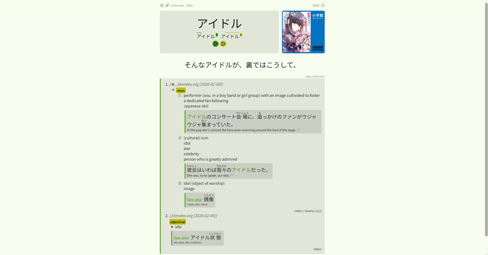
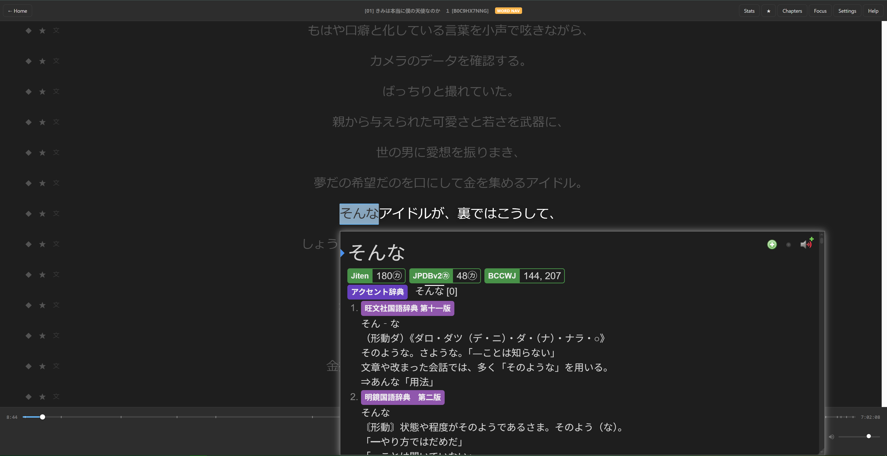
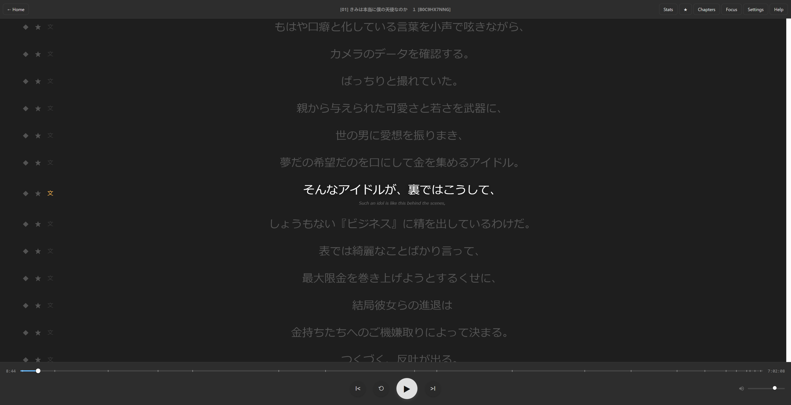

# kikiyomi (Fork)

**kikiyomi** is a powerful, single-file audiobook player designed specifically for Japanese language immersion. This fork adds deep integration for Anki, Yomitan, and live translation to the original experience.

<video src="demo.webm" controls width="100%"></video>

## 🚀 Added Features (v1.3.2)

- **Anki Integration:** Attach the audiobooks audio snippet and book cover art directly to your most recent Anki card with a single tap.
  
- **Word Navigation Mode:** Move word-by-word through subtitles to trigger **Yomitan** lookups without using a mouse. Perfect for couch immersion.
  
- **Live Translation:** Instant translation of subtitle lines via Google Translate. Free, fast, and cached for offline reading.
  
- **Improved UI:** Refined layouts, inline controls (Anki, Star, Translate, Copy), and dynamic library cards.
- **Full Gamepad Support:** Fully playable via PS4, Xbox, or standard HID controllers.

## 🛠️ Features

- **Immersive Focus Mode:** OLED-black background with large, customizable text for deep focus.
- **Smart History:** Persistently remembers your progress and statistics for every book in your library.
- **Gap Filling:** Automatically keeps the previous line visible during silences for better context.
- **Audiobook Metadata:** Extracts chapters and cover art from `.m4b` and `.mp3` files.

## 🎮 Controls

### Normal Mode
| Action | Keyboard | Gamepad |
| :--- | :--- | :--- |
| Play / Pause | Space / W | A / Cross (0) |
| Next / Prev Line | D / A | D-pad R / L |
| Replay Line | S | D-pad Down |
| Next / Prev Chapter| E / Q | R1 / L1 (RB / LB) |
| **Anki Integration** | **C** | **Menu / Options (9)** |
| **Translate Line** | **T** | **X / Square (2)** |
| Toggle Focus Mode | F | Y / Triangle (3) |
| **Enter Word Nav** | **N** | **LT / L2 (6)** |

### Word Navigation Mode
| Action | Keyboard | Gamepad |
| :--- | :--- | :--- |
| Move Word L / R | B / M | D-pad L / R |
| **Trigger Yomitan** | **Enter / Space**| **A / Cross (0)** |
| **Anki Integration** | **C** | **Menu / Options (9)** |
| **Translate Line** | **T** | **X / Square (2)** |
| Exit Word Nav | N | LT / L2 (6) |

### External Macros (Recommended for full immersion)
For actions that require direct interaction with browser extensions (like Yomitan), it is recommended to use external software like **DS4Windows** to map gamepad buttons to keyboard shortcuts:

| Action | Keyboard Shortcut | Recommended Gamepad Mapping |
| :--- | :--- | :--- |
| **Yomitan: Add Card** | `Alt + E` | **Y / Triangle (3)** |
| **Yomitan: Close** | `Esc` | **B / Circle (1)** |

*Note: Since these buttons are handled via DS4Windows, they will trigger Yomitan's internal shortcuts directly. You can download a pre-configured profile here: [kikiyomi_ds4.xml](https://github.com/JSOClarke/my_configs/blob/main/kikiyomi_ds4.xml).*

## 🚀 Getting Started

1.  Open the [live player](https://rtr46.github.io/kikiyomi).
2.  Drag and drop your `.m4b` or `.mp3` file (and optional `.srt`) onto the drop zone.
3.  Configure your Anki fields in **Settings** if using the additional features.

## 📄 License
GPL-3.0
